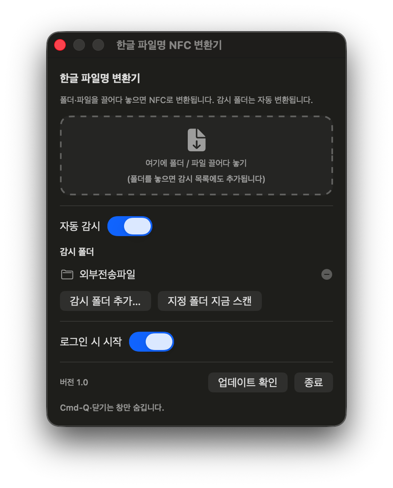

# 한글 파일명 변환기 (NFCNameFixer)

[](LICENSE)

[](https://github.com/drzekil-dev/NFCNameFixer/releases/latest)


맥에서 만든 한글 파일·폴더 이름을 Windows 호환(NFC)으로 바꿔주는 macOS 메뉴바 앱입니다. (v1.0) — 드래그 변환 + 폴더 자동 감시.

## 다운로드

[**최신 릴리스 다운로드 →**](https://github.com/drzekil-dev/NFCNameFixer/releases/latest)

`NFCNameFixer-<버전>.zip`을 풀어 `NFCNameFixer.app`을 실행하세요. ad-hoc 서명이라 첫 실행 시 **우클릭 → 열기**로 한 번 허용하면 됩니다.



## 왜 필요한가

macOS는 한글 파일명을 **NFD**(자모 분리: `ㅎ+ㅏ+ㄴ`)로 저장하고 Windows는 **NFC**(완성형: `한`)를 기대합니다. 그래서 맥에서 만든 한글 파일을 메일/압축으로 보내면 Windows에서 `ㅎㅏㄴㄱㅡㄹ`처럼 풀어져 보입니다. 이 앱은 파일·폴더 이름을 NFC로 바꿔 이 문제를 해결합니다.

## 사용법

이 앱은 **메뉴바 상주 데몬**입니다. 실행하면 Dock 아이콘 없이 상단 메뉴바에 아이콘만 뜹니다. 아이콘을 클릭하면 패널(창)이 열립니다.

- **드래그앤드롭**: 폴더/파일을 끌어다 놓으면 즉시 NFC 변환 (폴더는 감시 목록에도 추가됨)
- **자동 감시**: 켜두면 감시 폴더에 새 한글 파일이 생길 때마다 자동으로 NFC 변환
- **감시 폴더 추가…** / **지정 폴더 지금 스캔**(이벤트 누락 의심 시 수동 회수)
- **로그인 시 시작**: 로그인할 때 자동으로 데몬 실행
- **업데이트 확인**: GitHub 최신 릴리스와 비교해 새 버전이 있으면 다운로드 페이지를 엽니다. 하단에 현재 **버전**이 표시됩니다.

> 이미 올바른 이름(정상 NFC 한글·ASCII)은 절대 건드리지 않습니다. Cmd-Q·창 닫기는 창만 숨기고, 종료는 패널의 "종료" 버튼(또는 메뉴바 아이콘 우클릭)으로만.

### 자동 감시 방식

폴링이 아니라 **FSEvents(이벤트/인터럽트형 push)** 로 감시합니다. 평소엔 거의 0에 가까운 부하로 대기하다가 커널이 변경 시점에 깨웁니다. 이벤트 유실(앱 꺼짐, 커널 드롭, 합치기)에 대비해 **시작 시 전체 스캔 + 드롭/재스캔 플래그 처리 + 패널 열 때 재확인 + 수동 "지금 스캔"** 으로 빈틈을 메웁니다.

### 권한·배포 주의

- `~/Downloads`, `~/Desktop`, `~/Documents` 등 보호된 폴더를 처음 감시할 때 macOS가 접근 허용 창을 띄웁니다 → "허용" 클릭.
- 로그인 항목(`SMAppService`)은 앱이 안정된 위치에 있을 때 잘 동작 → 빌드 후 `/Applications`로 옮기는 것을 권장.
- ad-hoc 서명이라 첫 실행 시 Gatekeeper 경고가 뜨면 우클릭 > 열기로 1회 허용.

## 빌드 / 테스트

추가 설치 없이 Xcode 명령행 도구(swiftc)만으로 빌드됩니다.

```bash
./build.sh          # NFCNameFixer.app 생성 (없으면 아이콘도 자동 생성)
open NFCNameFixer.app
./tests/run.sh      # 복원 로직 단위 테스트 (전부 PASS 확인)
```

## 동작 원리 (핵심)

- `FileManager`/`URL`은 디스크의 NFD 바이트를 **읽는 즉시 NFC 문자열로 정규화**해버려서,
  Foundation API만으로는 "이 이름이 NFD다"라는 사실조차 알 수 없습니다.
- 그래서 POSIX `opendir`/`readdir`로 **raw 바이트**를 직접 읽고, `rename(2)`에 raw 바이트
  경로를 그대로 넘깁니다. APFS는 정규화 비민감이지만 바이트는 **보존**하므로,
  source(NFD)와 dest(NFC)의 바이트가 다르면 디스크에 실제로 NFC 바이트로 저장됩니다.
- 변환 필요 여부는 `String.compare(_:options: .literal)` 로 판단합니다(정규화 없이 코드 유닛 비교).
- 폴더는 **하위 항목을 먼저** 변환한 뒤 자신을 변환합니다(경로 무효화 방지).

## 구성

```
NFCNameFixer/
├─ Sources/
│  ├─ Converter.swift          # NFC 변환 엔진 (POSIX 기반)
│  ├─ FolderWatcher.swift      # FSEvents 폴더 감시 + 누락 방지
│  ├─ WatchStore.swift         # 설정/상태 (감시 폴더, 자동시작 등)
│  ├─ UpdateChecker.swift      # GitHub 릴리스 기반 업데이트 확인
│  ├─ NFCNameFixerApp.swift    # 메뉴바 앱 + 패널
│  ├─ MojibakeRestorer.swift   # (복원 기능, 현재 비활성) charset 재해석 + 점수 ← 테스트 대상
│  └─ NameRestorer.swift       # (복원 기능, 현재 비활성) 폴더/파일 깨진 이름 복원
├─ tests/
│  ├─ main.swift               # 복원 단위 테스트
│  └─ run.sh                   # 테스트 실행
├─ tools/                      # 앱 아이콘 생성기 (make_icon.swift / .sh)
├─ Info.plist                  # LSUIElement=true (메뉴바 전용)
├─ build.sh
├─ check.sh                    # 폴더의 NFC 여부 검사 스크립트
├─ MANUAL.md                   # 사용 설명서(간단)
└─ README.md
```
