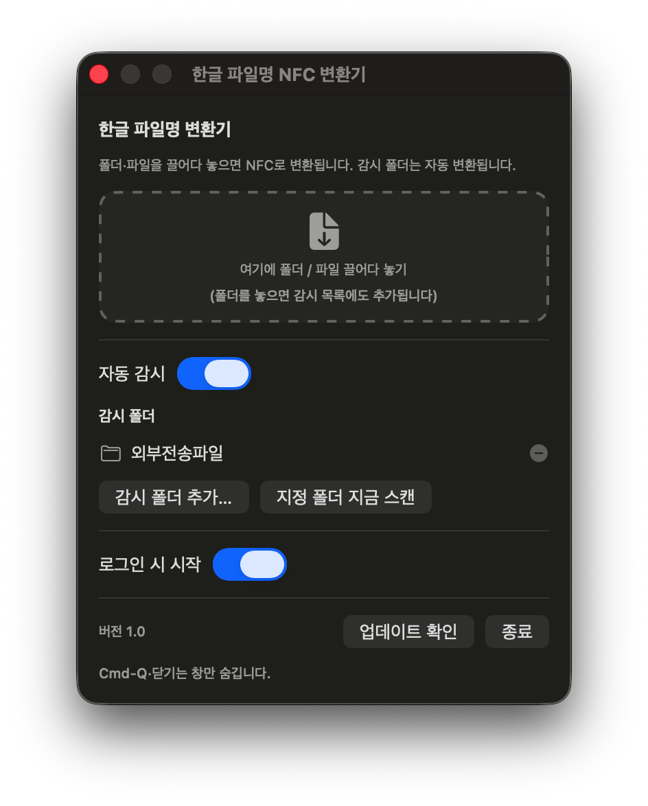

# 한글모아 (NFCNameFixer)

[](LICENSE)

[](https://github.com/drzekil-dev/NFCNameFixer/releases/latest)


**맥 한글 파일명, 윈도우에서도 멀쩡하게.** 맥에서 만든 한글 파일·폴더 이름을 Windows 호환(NFC)으로 바꿔주는 macOS 메뉴바 앱입니다. — 드래그 변환 + zip 내부 이름 수정 + 폴더 자동 감시 + Chrome 업로드 픽서 확장.

## 다운로드

[**최신 릴리스 다운로드 →**](https://github.com/drzekil-dev/NFCNameFixer/releases/latest)

`NFCNameFixer-<버전>.zip`을 풀어 `NFCNameFixer.app`을 실행하세요. ad-hoc 서명이라 첫 실행 시 **우클릭 → 열기**(macOS 15+는 시스템 설정 → 개인정보 보호 및 보안 → **"그래도 열기"**)로 한 번 허용하면 됩니다.

> "손상되었기 때문에 열 수 없습니다"가 뜨면 2026-07-07 이전에 받은 zip입니다 — 최신 릴리스로 다시 받아주세요.



## 왜 필요한가

macOS는 한글 파일명을 **NFD**(자모 분리: `ㅎ+ㅏ+ㄴ`)로 저장하고 Windows는 **NFC**(완성형: `한`)를 기대합니다. 그래서 맥에서 만든 한글 파일을 메일/압축으로 보내면 Windows에서 `ㅎㅏㄴㄱㅡㄹ`처럼 풀어져 보입니다. 이 앱은 파일·폴더 이름을 NFC로 바꿔 이 문제를 해결합니다.

## 사용법

이 앱은 **메뉴바 상주 앱**입니다. Dock 아이콘 없이 상단 메뉴바에 아이콘만 뜨고, 아이콘을 클릭하면 창이 열립니다.

### 1. 다운로드 & 실행
- [릴리스 페이지](https://github.com/drzekil-dev/NFCNameFixer/releases/latest)에서 `NFCNameFixer-x.x.x.zip`을 받아 압축을 풉니다.
- 나온 `NFCNameFixer.app`은 **처음 열 땐 더블클릭이 아니라 우클릭 → 열기**로 실행하세요. (ad-hoc 서명이라 그냥 열면 macOS Gatekeeper가 막습니다. 한 번만 이렇게 하면 다음부턴 그냥 열립니다. macOS 13 이상)
- 실행하면 **화면 위쪽 메뉴바에 아이콘**(`텍스트` 모양)이 생깁니다.

### 2. 그때그때 수동 변환
- 메뉴바 아이콘을 클릭해 창을 엽니다.
- 변환할 **폴더나 파일을 창의 점선 영역(드롭존)에 끌어다 놓기** → 즉시 변환됩니다. 하위 폴더까지 전부 NFC로 바뀝니다.
- 이미 정상인 이름·영문(ASCII) 파일은 **건드리지 않으니** 아무거나 던져도 안전합니다.
- 드롭한 게 폴더면 아래 **감시 목록에도 자동 추가**됩니다.
- **zip 파일을 직접 드롭**하면 풀지 않고 **zip 내부의 파일명**을 윈도 호환으로 고칩니다(원본 제자리 교체, 비밀번호 zip 가능).

### 3. 폴더 자동 감시 (핵심)
- **"감시 폴더 추가…"** 버튼으로 자주 쓰는 폴더(예: 다운로드, 작업 폴더)를 등록합니다.
- **"자동 감시"** 스위치를 켜두면, 그 폴더에 새 한글 파일이 생기거나 들어올 때마다 **자동으로 NFC 변환**합니다.
- 처음 `다운로드`·`데스크탑`·`문서` 같은 보호 폴더를 감시하면 macOS가 **접근 허용 창**을 한 번 띄웁니다 → **허용**을 눌러주세요. (그 뒤 창을 닫았다 다시 열면 감시가 정상 동작합니다.)
- **감시 폴더에 들어온 zip은 내부 파일명까지 자동으로 고칩니다.** 그냥 던져 두면 됩니다.
  - 쓰는 중인 zip은 끝날 때까지 기다렸다가 처리하고, 앱이 꺼져 있던 동안 들어온 zip은 다음 실행 때 처리합니다.
  - **조용하면 다 된 것입니다.** 고치지 못한 파일이 있으면 **메뉴바 아이콘이 경고 모양(⚠)으로 바뀌고** 알림이 뜨며, 창의 **"최근 처리"** 에 파일과 사유가 남습니다.
  - 이미 정상인 zip과 윈도에서 만든 zip은 건드리지 않습니다. 7z·RAR·ALZ·EGG는 내부 이름을 고칠 수 없어, 이 맥에서 만든 것이 들어오면 그렇다고 알려 줍니다.
  - 받은 zip도 대상입니다(내용물은 그대로, 이름과 `__MACOSX`만 바뀌지만 파일 해시는 달라집니다). 해시 대조가 필요한 zip을 받는 폴더는 감시 목록에 넣지 마세요.
- 놓친 게 있나 싶을 땐 **"지정 폴더 지금 스캔"** 으로 감시 폴더 전체를 한 번에 정리할 수 있습니다.
- 감시는 폴링이 아니라 **FSEvents(이벤트 기반)** 라 평소 부하가 거의 없습니다.

### 4. 로그인 시 자동 시작
- **"로그인 시 시작"** 스위치를 켜두면 맥을 켤 때마다 자동 실행됩니다.
- 로그인 항목(`SMAppService`)은 앱이 안정된 위치에 있을 때 잘 동작하므로, 앱을 **`응용 프로그램(/Applications)`** 폴더로 옮긴 뒤 켜는 것을 권장합니다.

### 5. 업데이트 & 종료
- 창 하단 **현재 버전**과 **"업데이트 확인"** 버튼 — GitHub 최신 릴리스와 비교해 새 버전이 있으면 다운로드 페이지를 엽니다.
- 창에서 **⌘Q·닫기**를 누르면 앱이 꺼지지 않고 **창만 숨겨지며** 메뉴바엔 계속 남습니다.
- 완전히 끄려면 창의 **"종료"** 버튼 또는 **메뉴바 아이콘 우클릭 → 종료**.

## 파일 보낼 때 주의 (윈도로 전송)

NFC로 고쳐도 **보내는 방법** 때문에 윈도에서 다시 깨질 수 있습니다(직접 테스트로 확인).

- macOS 기본 "압축"으로 만든 zip은 내부 이름이 NFD인 데다 UTF-8 파일명 플래그도 없어 윈도에서 깨집니다 → **감시 폴더 안에서 압축하거나, zip을 드롭존에 끌어다 놓으세요.** 압축을 풀지 않고 내부 항목 이름을 NFC로 고치고 UTF-8 플래그를 켜며, 윈도에서 쓸모없는 `__MACOSX` 항목도 제거합니다. **비밀번호 zip도 됩니다**(이름은 암호화되지 않으므로 비밀번호가 필요 없습니다). Windows 10 이후 탐색기·반디집·7-Zip 모두 올바르게 읽습니다.
  - 7z·RAR·ALZ·EGG는 이름이 압축 블록 안에 있어 지원하지 않습니다. zip만 됩니다.
- 웹 Gmail도 **Chrome은 업로드 시 파일명을 NFD로 되돌립니다**([Chromium 버그 125271](https://bugs.chromium.org/p/chromium/issues/detail?id=125271)). 해결 방법:
  - **Safari로 첨부**하거나 **맥 "메일" 앱**으로 보내기, 또는
  - 이 저장소의 **[Chrome 확장](chrome-extension/)** 설치 — 업로드 직전에 파일명을 NFC로 정규화해 Chrome에서도 안전하게 첨부됩니다. (설치법은 [chrome-extension/README.md](chrome-extension/README.md))

## 빌드 / 테스트

추가 설치 없이 Xcode 명령행 도구(swiftc)만으로 빌드됩니다.

```bash
./build.sh          # NFCNameFixer.app 생성 (없으면 아이콘도 자동 생성)
open NFCNameFixer.app
./tests/run.sh      # 복원·zip·드롭·자동 수정 테스트 (전부 PASS 확인, 약 1분)
```

## 동작 원리 (핵심)

- `FileManager`/`URL`은 디스크의 NFD 바이트를 **읽는 즉시 NFC 문자열로 정규화**해버려서,
  Foundation API만으로는 "이 이름이 NFD다"라는 사실조차 알 수 없습니다.
- 그래서 POSIX `opendir`/`readdir`로 **raw 바이트**를 직접 읽고, `rename(2)`에 raw 바이트
  경로를 그대로 넘깁니다. APFS는 정규화 비민감이지만 바이트는 **보존**하므로,
  source(NFD)와 dest(NFC)의 바이트가 다르면 디스크에 실제로 NFC 바이트로 저장됩니다.
- 변환 필요 여부는 `String.compare(_:options: .literal)` 로 판단합니다(정규화 없이 코드 유닛 비교).
- 폴더는 **하위 항목을 먼저** 변환한 뒤 자신을 변환합니다(경로 무효화 방지).

## 구성

```
NFCNameFixer/
├─ Sources/
│  ├─ Converter.swift          # NFC 변환 엔진 (POSIX 기반)
│  ├─ ZipNameFixer.swift       # zip 내부 이름 NFC 수정 (압축 안 풀고 구조만 재작성)
│  ├─ DropProcessor.swift      # 드롭 분류·처리·요약 (zip / 그 외) ← 테스트 대상
│  ├─ ArchiveAutoFixer.swift   # 감시 폴더 zip 자동 수정(대기·재시도) + 처리 기록 ← 테스트 대상
│  ├─ FolderWatcher.swift      # FSEvents 폴더 감시 + 누락 방지 (직렬 큐)
│  ├─ WatchStore.swift         # 설정/상태 (감시 폴더, 자동시작 등)
│  ├─ UpdateChecker.swift      # GitHub 릴리스 기반 업데이트 확인
│  ├─ NFCNameFixerApp.swift    # 메뉴바 앱 + 패널
│  ├─ MojibakeRestorer.swift   # (복원 기능, 현재 비활성) charset 재해석 + 점수 ← 테스트 대상
│  └─ NameRestorer.swift       # (복원 기능, 현재 비활성) 폴더/파일 깨진 이름 복원
├─ tests/
│  ├─ main.swift               # 복원 단위 테스트
│  ├─ zip_test.sh, zip/        # zip 수정 통합 테스트 (Finder·비밀번호 zip 픽스처)
│  ├─ drop_test.sh, drop/      # 드롭 처리 테스트 (GUI 없이)
│  ├─ auto_test.sh, auto/      # 감시 폴더 zip 자동 수정 테스트 (실제 FSEvents, 약 20초)
│  └─ run.sh                   # 테스트 실행
├─ chrome-extension/           # Chrome 확장 — 업로드 시 NFD→NFC 정규화
├─ tools/                      # 앱 아이콘 생성기 (make_icon.swift / .sh)
├─ Info.plist                  # LSUIElement=true (메뉴바 전용)
├─ build.sh
├─ check.sh                    # 폴더의 NFC 여부 검사 스크립트
├─ MANUAL.md                   # 사용 설명서(간단)
└─ README.md
```
